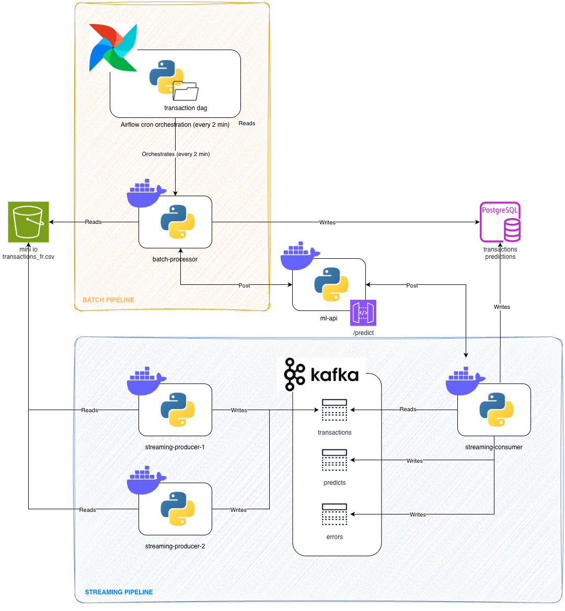
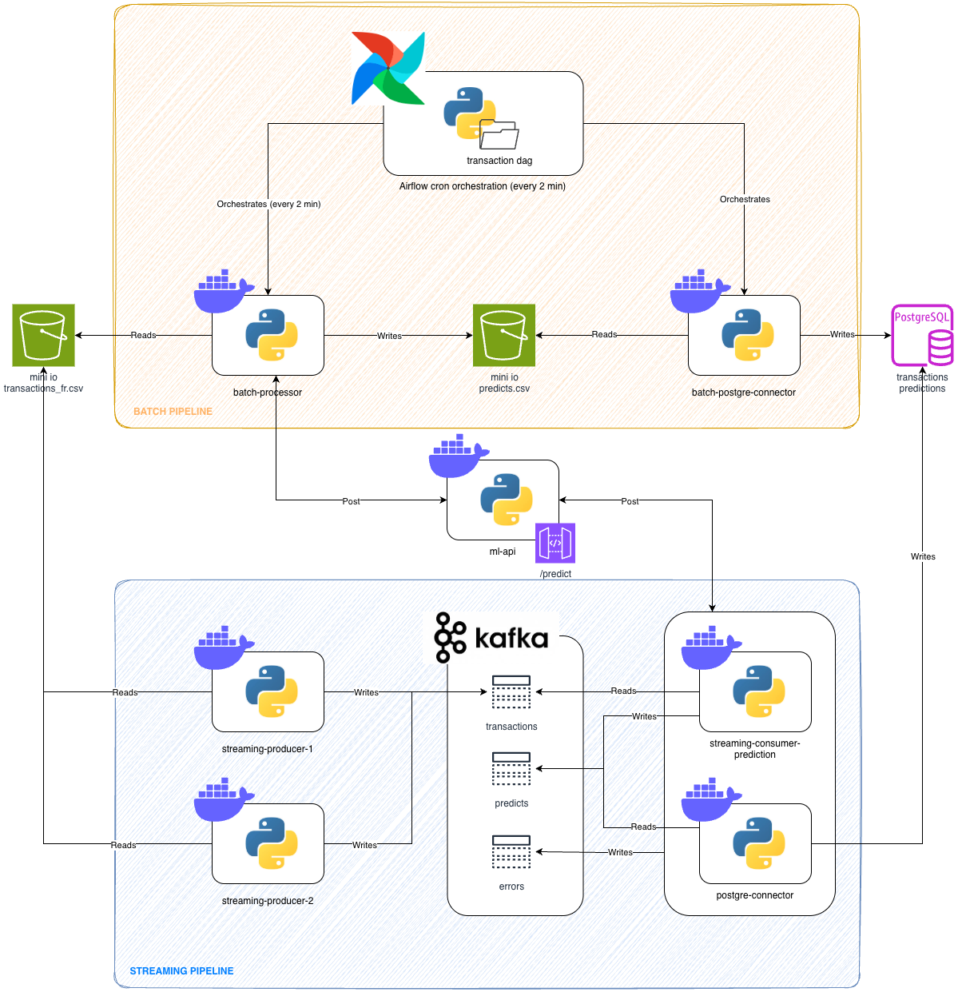

# Design Notes & Architecture

## Table of Contents

- [Architecture Overview](#architecture-overview)
- [Current Architecture](#current-architecture)
- [Target Architecture](#target-architecture)
- [Technology Choices](#technology-choices)
- [Trade-offs & Design Decisions](#trade-offs--design-decisions)
- [Code Organization](#code-organization)
- [Quality Assurance](#quality-assurance)
- [Future Improvements](#future-improvements)

---

## Architecture Overview

This project implements a dual-pipeline system for transaction classification: a **batch pipeline** for historical data processing and a **streaming pipeline** for real-time event processing. Both pipelines share common business logic through a clean architecture approach, ensuring code reusability and maintainability.

---

## Current Architecture



*Figure 1: Current implementation with batch (Airflow) and streaming (Kafka) pipelines*

### Key Components

#### Data Storage
- **MinIO (Object Storage)**: Centralized storage for CSV transactions
  - **Rationale**: Provides a single source of truth accessible by any application
  - **Benefit**: Avoids mounting files as volumes for each application
  - **S3-Compatible**: Easy migration to cloud storage if needed

#### Batch Pipeline
- **Apache Airflow**: Orchestration and scheduling
  - **DAG-based workflow**: Visual representation of batch processing
  - **Scheduling**: Cron-based execution for periodic processing
  - **Monitoring**: Built-in UI for job tracking and debugging

#### Streaming Pipeline
- **2 Kafka Producers**: Simulate real-time transaction events
  - **Producer 1**: Generates 1-10 records every 0.5 seconds
  - **Producer 2**: Generates 5-20 records every 1.0 second
  - **Purpose**: Realistic simulation of varying event rates

- **Kafka Topics**: 
  - `transactions`: Incoming transaction events
  - `failed-transactions`: Dead Letter Queue (DLQ) for error handling
  - **Replication Factor**: 3 for all topics
    - **Rationale**: Ensures resilience and reliability
    - **Trade-off**: Higher storage requirements for data durability

- **Consumer Group**: Parallel processing with load distribution

#### Backend
- **PostgreSQL**: Relational database for storing transactions and predictions
  - **ACID compliance**: Ensures data consistency for financial transactions
  - **Lineage tracking**: Captures processing metadata (batch_id, run_id, processing_type)

### Design Decisions

#### Buffering vs. Latency Trade-off
**Decision**: Buffer streaming data before API calls and database writes

**Rationale**:
- **Optimized API calls**: Batch multiple transactions in single requests
- **Efficient database operations**: Bulk inserts reduce transaction overhead
- **Reduced network overhead**: Fewer round trips to external services

**Trade-off**:
- ✅ Better throughput and resource utilization
- ✅ Lower operational costs (fewer API calls)
- ❌ Increased latency (buffering delay)
- ⚖️ **Acceptable for use case**: Depends on client SLA requirements

**Alternative**: Lower latency by increasing API call frequency and database transactions at the cost of higher resource usage.

---

## Target Architecture



*Figure 2: Proposed architecture with improved separation of concerns and connector pattern*

### Key Improvements

#### 1. Decoupled Processing (Single Responsibility Principle)

**Current**: Consumer reads from Kafka → validates → predicts → writes to PostgreSQL (all in one)

**Target**: Separate concerns into independent components
- **Prediction Service**: Focus solely on calling ML API and publishing results
- **Kafka Connectors**: Handle data persistence to various backends
- **Benefit**: Each component has a single, well-defined responsibility

#### 2. Connector-Based Architecture (Fan-out Pattern)

**Approach**: Stream processing writes to Kafka topics, connectors handle backend integration

**Components**:
- **Topic: transactions** → Original transaction events
- **Topic: predictions** → Classification results from ML API
- **Topic: errors** → Failed records for monitoring

**Connectors** (fan-out from topics):
- **PostgreSQL Connector**: Persist to relational database
- **Elasticsearch Connector**: Full-text search and analytics
- **Prometheus/InfluxDB Connector**: Metrics and monitoring
- **S3 Connector**: Archival and data lake

**Benefits**:
- ✅ **Flexibility**: Add/remove backends without changing streaming application
- ✅ **Scalability**: Each connector scales independently
- ✅ **Separation of concerns**: Streaming app focuses on transformations, connectors handle persistence
- ✅ **Reusability**: Same topic consumed by multiple downstream systems

#### 3. API Output Validation

**Current**: API output validation is "all or nothing" (entire batch fails on malformed response)

**Target**: Add Pydantic models for API output validation
- **Predict Model**: Validate individual prediction responses
- **Partial failure handling**: Process valid predictions, log invalid ones
- **Resilience**: Application continues even with partial API failures

**Implementation**:
```python
class PredictOutput(BaseModel):
    transaction_id: str
    category: str
    confidence_score: float
    
    @field_validator('confidence_score')
    def validate_confidence(cls, v):
        if not 0 <= v <= 1:
            raise ValueError('Confidence must be between 0 and 1')
        return v
```

#### 4. Unified Model Across Services

**Current**: ML API uses separate models from application code (code duplication)

**Target**: Shared model library used by both API and applications
- **Single source of truth**: `Transaction` and `Predict` models defined once
- **Dependency management**: Use `uv` for ML API (consistent with applications)
- **Task execution**: Consolidate quality/test scripts in single `pyproject.toml` using `poe`

**Benefits**:
- ✅ No model drift between API and consumers
- ✅ Consistent validation across services
- ✅ Easier maintenance and updates

---

## Technology Choices

### Package Management: uv

**Decision**: Use `uv` instead of pip or Poetry

**Rationale**:
- **Speed**: Written in Rust, significantly faster than Poetry
- **Completeness**: More feature-rich than plain pip (lock files, workspace support, virtual env management)
- **Modern**: Designed for modern Python workflows (PEP 621, pyproject.toml-first)
- **Reliability**: Deterministic dependency resolution with lock files

**Comparison**:
| Feature | pip | Poetry | uv |
|---------|-----|--------|-----|
| Speed | ⚡ | ⚡⚡ | ⚡⚡⚡⚡⚡ |
| Lock files | ❌ | ✅ | ✅ |
| Workspace support | ❌ | ⚠️ | ✅ |
| Virtual env management | ⚠️ | ✅ | ✅ |

### Orchestration: Apache Airflow

**Decision**: Use Airflow for batch orchestration

**Rationale**:
- **Industry standard**: Proven solution for batch processing
- **Visual monitoring**: DAG UI for workflow tracking
- **Scheduling**: Built-in cron-based scheduling
- **Extensibility**: Rich ecosystem of operators (DockerOperator used here)

### Message Broker: Apache Kafka

**Decision**: Use Kafka for streaming pipeline

**Rationale**:
- **Durability**: Messages persisted to disk (reliable event log)
- **Scalability**: Horizontal scaling via partitions (3 partitions configured)
- **Replayability**: Can reprocess messages from any offset
- **Ecosystem**: Rich connector ecosystem for target architecture

### Replication Strategy

**Decision**: Replication factor of 3 for all Kafka topics

**Rationale**:
- **Fault tolerance**: Survives up to 2 broker failures
- **Data durability**: No data loss even with broker failures
- **Industry best practice**: Standard for production Kafka clusters

**Trade-off**: Higher storage requirements (3x data replication)

---

## Trade-offs & Design Decisions

### 1. Buffering Strategy

**Decision**: Buffer events before processing (batch API calls and DB writes)

| Approach | Latency | Throughput | Cost | Use Case |
|----------|---------|------------|------|----------|
| **Buffered (Current)** | Higher (seconds) | Higher | Lower | Analytics, reporting |
| **Immediate** | Lower (milliseconds) | Lower | Higher | Real-time alerts, monitoring |

**Chosen**: Buffered approach for better resource utilization
**Depends on**: Client SLA requirements (acceptable latency window)

### 2. Single-Node vs. Distributed Processing

**Current**: Single-node Python applications (vertical scaling)

**Appropriate for**:
- Low to medium data volumes
- Cost-sensitive environments
- Simpler operational overhead

**Limitations**:
- Vertical scaling has limits
- Single point of failure
- Cannot leverage distributed computing benefits

**Alternative** (for higher volumes): 
- Apache Flink or Spark/Spark Streaming
- Lambda architecture pattern (unified batch/streaming logic)
- Horizontal scaling across multiple nodes

### 3. Error Handling Strategy

**Current**: Exponential backoff retries for both API calls and PostgreSQL transactions

**Rationale**:
- **Universal solution**: Works for various transient failures (network issues, temporary overload)
- **Simple implementation**: Easy to understand and maintain
- **Graceful degradation**: Backs off when service is struggling

**Limitation**: 
- Generic approach doesn't differentiate between error types
- Could implement more targeted solutions (e.g., circuit breakers for sustained failures)

**Future improvement**: Targeted error handling strategies per failure type

### 4. Storage Backend Choice

**Current**: PostgreSQL for all data

**Appropriate for**:
- Structured, relational data
- ACID transaction requirements
- SQL-based analytics

**Future considerations** (based on volume and use case):
- **Time-series DB** (InfluxDB, Prometheus): Transactions are inherently time-series
- **NoSQL** (Cassandra, MongoDB): Better horizontal scaling for massive volumes
- **Data Lakehouse** (Delta Lake, Apache Iceberg): Analytics-first, cost-effective storage
- **Choice depends on**: Query patterns, latency requirements, data volume, analytics needs

---

## Code Organization

### Clean Architecture Implementation

The codebase follows **Hexagonal Architecture** (Ports & Adapters pattern) to separate business logic from infrastructure concerns.

```
pipeline/
├── library/                 # Shared business logic
│   ├── src/
│   │   ├── core/           # Domain layer (business logic)
│   │   │   ├── model.py            # Pydantic data models (Transaction, Predict)
│   │   │   ├── protocol.py         # Interface definitions (DataSource, MLService)
│   │   │   ├── orchestrate.py      # Business orchestration logic
│   │   │   └── data_validation.py  # Validation rules
│   │   │
│   │   └── infrastructure/ # Adapter layer (external services)
│   │       ├── api.py              # ML API client (with retry logic)
│   │       ├── database.py         # PostgreSQL models & operations
│   │       ├── files.py            # CSV/S3 file operations
│   │       └── service.py          # Service implementations
│   │
│   └── tests/              # Comprehensive test suite (48 tests, 100% passing)
│
└── application/            # Application-specific implementations
    ├── batch/
    │   ├── service/        # Batch processing application
    │   └── orchestration/  # Airflow DAGs
    │
    └── streaming/
        ├── producer/       # Kafka event generators
        └── consumer/       # Kafka consumer application
```

### Architecture Layers

#### 1. Core Layer (Domain Logic)
**Purpose**: Pure business logic, independent of infrastructure

**Components**:
- **Models**: Pydantic data models (`Transaction`, `Predict`)
- **Protocols**: Interface definitions (structural subtyping, no inheritance)
- **Orchestration**: Processing workflow coordination
- **Validation**: Business rule validation

**Benefits**:
- ✅ No external dependencies (database, API, Kafka)
- ✅ Easy to test (no mocking needed for pure logic)
- ✅ Portable across different infrastructures

#### 2. Infrastructure Layer (Adapters)
**Purpose**: Handle interactions with external services

**Components**:
- **API adapter**: ML service communication with retry logic
- **Database adapter**: PostgreSQL operations (SQLAlchemy)
- **File adapter**: CSV reading, S3/MinIO integration
- **Service adapter**: Base service implementation

**Serialization/Deserialization**:
- External service formats → Internal Pydantic models
- Pydantic models → External service formats

### Future Refactoring

#### Separate Libraries
**Current**: Core and infrastructure in single library

**Target**: Split into two independent libraries
- `dataeng-core`: Domain models and business logic
- `dataeng-infrastructure`: Adapters for external services

**Benefits**:
- ✅ True separation via interface abstraction
- ✅ Core can be tested without any infrastructure
- ✅ Infrastructure adapters can be swapped independently

**Implementation**:
- Define interfaces in core library
- Infrastructure implements interfaces (dependency inversion)
- Applications depend only on core abstractions

#### Library Versioning & Distribution
**Target**: Release libraries to artifact storage
- **Artifact repositories**: AWS CodeArtifact, GitLab Artifact Registry, Azure Artifacts
- **Semantic versioning**: Major.Minor.Patch (e.g., 1.0.0)
- **Release pipeline**: Automated via CI/CD
  - Run tests
  - Build packages
  - Publish to artifact storage
  - Tag release in Git

**Benefits**:
- ✅ Version pinning for applications
- ✅ Controlled dependency updates
- ✅ Reusability across multiple projects

---

## Quality Assurance

### CI/CD Simulation with Pre-commit

The project simulates CI/CD quality gates using **pre-commit hooks**:

```yaml
# .pre-commit-config.yaml
- ruff        # Code quality & formatting (replaces flake8, black, isort)
- pyright     # Static type checking
- pydocstyle  # Documentation style (Google/NumPy docstrings)
- pytest      # Unit test execution
```

**Execution**: Runs automatically before each commit

**Benefits**:
- ✅ Catches issues before code review
- ✅ Consistent code style across team
- ✅ Type safety guarantees
- ✅ Documentation quality enforcement

### Testing Strategy

**Current**: Focused testing on critical components

**Priority**: Core library (business logic)
- **Coverage**: 48 tests, 100% passing
- **Approach**: Protocol-based testing (minimal mocking)
- **Focus**: Data validation, orchestration, model validation

**Future**: Expand to infrastructure layer
- **Challenge**: Requires extensive mocking (database, API, Kafka)
- **Value**: Integration tests ensure services work together
- **Approach**: Test core within real service contexts

**Testing pyramid**:
```
    /\      E2E Tests (Future)
   /  \     
  /    \    Integration Tests (Infrastructure - Future)
 /      \   
/________\  Unit Tests (Core - Current ✅)
```

### Dependency Injection & Configuration

**Current**: Manual dependency injection in applications

**Future**: Factory pattern for cleaner instantiation
```python
# Current approach (manual)
service = BatchService(
    s3_path="s3://...",
    storage_options={...},
    ml_api_url="http://...",
    db_session=session
)

# Target approach (factory)
service = ServiceFactory.create_batch_service(config)
```

**Benefits**:
- ✅ Centralized configuration
- ✅ Easier testing (inject test configs)
- ✅ Cleaner application code

### Code Separation

**Future**: Extract ThreadPoolExecutor from orchestration library

**Current**: Thread pool management mixed with orchestration logic

**Target**: Separate execution strategy from orchestration
- **Orchestration**: Define *what* to process and *when*
- **Executor**: Handle *how* to execute (threading, async, distributed)

**Benefits**:
- ✅ Single responsibility principle
- ✅ Pluggable execution strategies
- ✅ Easier to test orchestration logic independently

---

## Future Improvements

### 1. Performance Optimizations

#### Asynchronous Streaming Consumer
**Current**: Synchronous consumer (blocking I/O)

**Target**: Async consumer with `asyncio`
- **Non-blocking I/O**: Handle multiple messages concurrently
- **Better resource utilization**: Single thread handles many connections
- **Higher throughput**: Process more messages per second

**Implementation**:
```python
async def consume_messages():
    async for message in consumer:
        await process_transaction(message)
```

#### Memory-Efficient CSV Reading
**Current**: Load entire CSV into memory with Polars

**Target**: Streaming CSV reader
```python
# Instead of
df = pl.read_csv("large_file.csv")  # Loads all data

# Use streaming
for batch in pl.read_csv_batched("large_file.csv", batch_size=10000):
    process_batch(batch)  # Process incrementally
```

**Benefits**:
- ✅ Constant memory usage regardless of file size
- ✅ Can process files larger than available RAM
- ✅ Faster time to first result

### 2. Error Persistence

**Current**: Errors logged but not persisted for reprocessing

**Target**: Persist errors for analysis and retry

**Batch Pipeline**:
- Write invalid records to CSV on MinIO
- Separate file per batch run with error details
- Enable manual review and correction

**Streaming Pipeline**:
- Write failed messages to Dead Letter Queue (DLQ) topic
- Include error details in message headers
- Separate consumer for DLQ processing and alerting

**Implementation**:
```python
# Batch: Write errors to MinIO
errors_df.write_csv(f"s3://bucket/errors/batch_{batch_id}.csv")

# Streaming: Produce to DLQ
producer.produce(
    topic="failed-transactions",
    value=message_value,
    headers={"error": error_message, "retry_count": "3"}
)
```

### 3. Streaming Predictions Topic

**Current**: Streaming consumer writes predictions directly to PostgreSQL

**Target**: Write predictions to Kafka topic
- **Topic**: `predictions`
- **Schema**: Validated prediction results
- **Consumers**: PostgreSQL connector, analytics services, monitoring tools

**Benefits**:
- ✅ Decouples prediction from persistence
- ✅ Multiple consumers can use predictions
- ✅ Enables real-time analytics pipelines

### 4. Distributed Processing for High Volume

**Current**: Single-node applications (vertical scaling)

**Target**: Distributed processing frameworks

**Options**:

#### Apache Flink
- **Strengths**: True streaming, low latency, stateful processing
- **Use case**: Real-time processing with complex event processing

#### Apache Spark (Batch) / Spark Streaming
- **Strengths**: Unified API for batch and streaming (Lambda architecture)
- **Use case**: Same code runs in batch and streaming modes
- **Benefits**: 
  - Code reuse across pipelines
  - Horizontal scaling (distribute across nodes)
  - Fault tolerance built-in

**When to migrate**:
- Data volume exceeds single-node capacity
- Sub-second latency required
- Need for stateful computations (windowing, aggregations)

### 5. Alternative Storage Backends

**Current**: PostgreSQL for all data

**Future options** (based on use case):

#### Time-Series Databases
- **InfluxDB**: Purpose-built for time-series data
- **Prometheus**: Metrics and monitoring
- **Use case**: Real-time monitoring dashboards
- **Benefits**: 
  - Optimized for time-series queries
  - Better compression for sequential data
  - Built-in downsampling and retention policies

#### Data Lakehouse
- **Delta Lake** / **Apache Iceberg** / **Apache Hudi**
- **Storage**: Parquet files in S3/MinIO
- **Use case**: Analytics workloads, data science
- **Benefits**:
  - Cost-effective (cheap object storage)
  - ACID transactions on data lake
  - Time travel (query historical data)
  - Schema evolution

#### NoSQL Databases
- **Cassandra**: Massive scale, write-heavy workloads
- **MongoDB**: Flexible schema, document-oriented
- **Use case**: Very high volume, distributed writes
- **Benefits**: Horizontal scaling, high availability

**Decision criteria**:
- **Query patterns**: OLTP vs. OLAP
- **Latency requirements**: Real-time vs. batch analytics
- **Data volume**: GB vs. TB vs. PB
- **Cost**: Operational cost vs. storage cost

### 6. Enhanced Test Coverage

**Current**: 48 tests focused on core library

**Future**:
1. **Infrastructure tests**: Test adapters with mocked services
2. **Integration tests**: Test core with real services (Docker containers)
3. **Contract tests**: Ensure API contract compliance
4. **Load tests**: Validate performance under high volume
5. **Chaos engineering**: Test failure scenarios

**Target**: >80% code coverage across all layers

### 7. Advanced Error Handling

**Current**: Generic exponential backoff for all errors

**Future**: Targeted error handling strategies

**Circuit Breaker Pattern**:
```python
# Stop calling failing service after threshold
if error_rate > threshold:
    return cached_response  # Fail fast
# Try again after cooldown period
```

**Error Classification**:
- **Retriable**: Network timeouts, rate limits → Retry
- **Non-retriable**: Invalid data, auth errors → Send to DLQ
- **Transient**: Temporary overload → Exponential backoff
- **Permanent**: Service down → Circuit breaker

### 8. Observability Enhancements

**Current**: Logs and UI tools (Kafka UI, Adminer, Airflow)

**Future**: Full observability stack

**Metrics** (Prometheus):
- Processing throughput (records/sec)
- Error rates by type
- API latency (p50, p95, p99)
- Database connection pool stats
- Kafka consumer lag

**Dashboards** (Grafana):
- Real-time pipeline health
- Historical trends and patterns
- SLA compliance tracking
- Alert thresholds visualization

**Tracing** (OpenTelemetry):
- End-to-end request tracking
- Service dependency mapping
- Performance bottleneck identification

**Alerting**:
- Consumer lag > threshold
- Error rate spike
- API latency degradation
- Database connection issues

---

## Summary

This implementation demonstrates production-grade data engineering practices with:

✅ **Clean Architecture**: Separation of domain logic and infrastructure  
✅ **Dual Pipelines**: Batch and streaming with shared business logic  
✅ **Resilience**: Retry logic, error handling, replication factor of 3  
✅ **Scalability**: Horizontal scaling ready, distributed processing path  
✅ **Quality**: 48 tests passing, pre-commit hooks, type checking  
✅ **Documentation**: Comprehensive READMEs and design notes  

The architecture provides a **solid foundation** with clear paths for:
- Enhanced observability
- Distributed processing for scale
- Flexible backend options via connector pattern
- Improved error handling and persistence
- Full test coverage and CI/CD integration

**Design philosophy**: Balance pragmatism with best practices, delivering a functional system while maintaining extensibility for future requirements.
